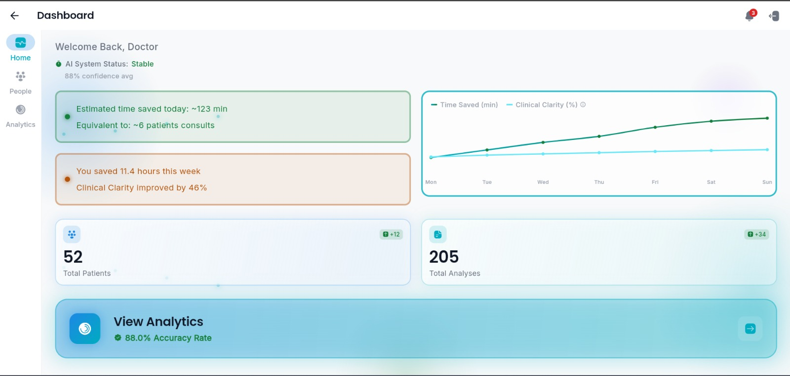
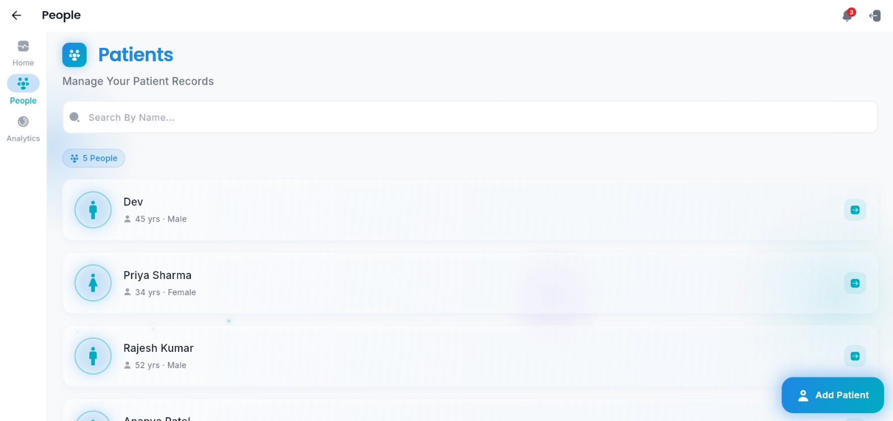
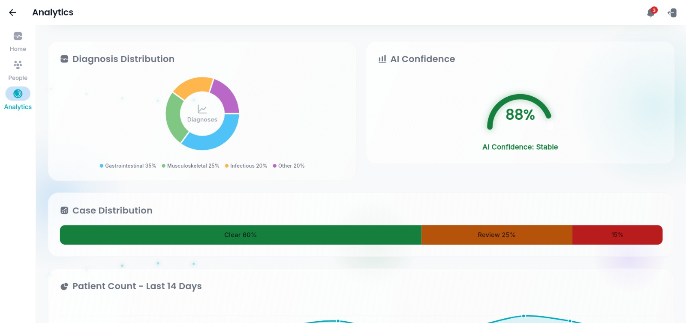
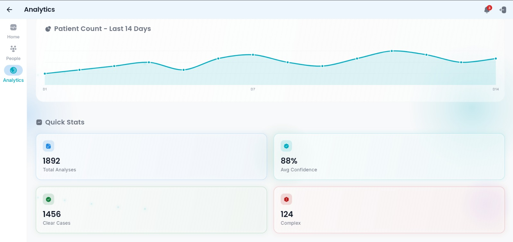

# MONAVI : Clinical AI Dashboard

<a id="readme-top"></a>

<div align="center">
  

  <p align="center">
    A comprehensive Flutter application for clinical analysis, patient management, and AI-driven medical insights.
    <br />
    <br />
  </p>
</div>

---

## 📖 About The Project

Clinical AI Dashboard is a cross-platform frontend application built with Flutter, designed for modern medical workflows. It enables healthcare professionals to seamlessly manage patient records, perform clinical analysis using AI APIs, generate detailed PDF reports, and visualize data through interactive charts and dashboards. The app is designed with a sleek dark theme and smooth animations for an optimal user experience.

**Key Features:**
* � **Authentication & Security:** Secure login/registration integrated with Firebase Auth and Secure Storage.
* 👥 **Patient Management:** Create, read, and manage comprehensive patient profiles.
* 🧠 **AI Clinical Analysis:** Upload patient medical data (images/files) and fetch AI analysis results.
* 📊 **Dashboard & Analytics:** Interactive charts (`fl_chart`) and statistics displaying patient distributions and data trends.
* � **PDF Reporting:** Automatically generate and export formatted clinical reports as PDFs.
* 🎨 **Modern UI:** Built with custom layouts, shimmer loading effects, and smooth animations using `flutter_animate`.
* 📱 **Cross-Platform:** Optimized to run natively on Web, Android, iOS, Windows, macOS, and Linux out-of-the-box.

---

## 🖼️ Screenshots and UI

Visuals help users understand your interface instantly.

| Feature | Preview |
| :--- | :--- |
| **Main Dashboard** |  |
| **Patient Management** |  |
| **Data Analytics (1)** |  |
| **Data Analytics (2)** |  |

---

## � Project Structure

```text
frontend/
├── assets/                # Local images and logo
├── lib/                   # Main Dart source code
│   ├── config/            # App theme and configurations
│   ├── models/            # Data models (Patient, Analysis, Doctor)
│   ├── providers/         # State management (Auth, Patient, Analysis)
│   ├── routes/            # App routing and navigation
│   ├── screens/           # Main UI screens (Auth, Dashboard, Patients)
│   ├── services/          # External services (API, Firebase, PDF, Network)
│   ├── shell/             # Main app shell/layout wrapper
│   ├── widgets/           # Reusable UI components (Buttons, Cards, Inputs)
│   ├── main.dart          # Application entry point
│   └── firebase_options.dart # Firebase configuration setup
├── pubspec.yaml           # Flutter dependencies and assets
└── README.md              # Project documentation
```

---

## �💻 Technology Used

This project is built using a modern, scalable Flutter tech stack:

* **Framework:**  
* **State Management:** Provider pattern internally integrated (`provider: ^6.1.5`).
* **Backend Integration:**  (Auth & Core), `dio` and `http` for custom AI analysis API calls.
* **Storage:** `flutter_secure_storage`, `shared_preferences`.
* **UI & Data Viz:** `fl_chart`, `percent_indicator`, `flutter_animate`, `shimmer`, `iconsax_flutter`.
* **Utility:** PDF generation (`pdf`, `printing`), File & Image picking (`file_picker`, `image_picker`).

---

## 🚀 Installation and Running

Follow these steps to get your local development environment set up.

### Prerequisites

* **Flutter SDK** (v3.9.2 or higher compatible)
* **Dart SDK**
* A valid emulator, simulator, or connected device to run the app.

### Connecting Firebase

* You need to configure Firebase metrics before compiling. Replace or update `lib/firebase_options.dart` if you connect to your own Firebase project via `flutterfire configure`.

### Running Locally

1. Clone the repository and navigate to the frontend folder.
2. Install the necessary packages:
   ```sh
   flutter pub get
   ```
3. Run the app on an available device/web:
   ```sh
   flutter run -d chrome
   ```